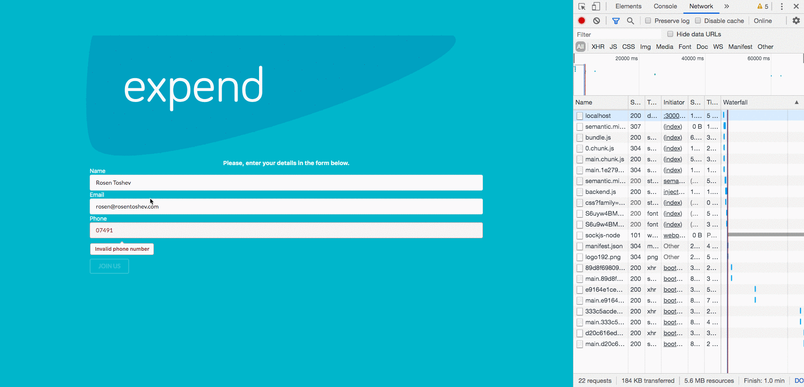
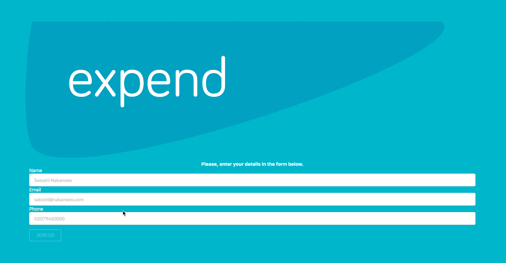

# Expend Registration Form

The purpose of this app is to help business users register to the Expend's dashboard and discover the benefits of having a flexible expenses solution with the power of Expend's smart payment card.

The app was developed using the `React` library with `redux` for managing the application state. The form itself was created using the `redux-form` HOC and the data was sent to the dummy api using the `redux-thunk` middleware.

## Launching the Expend Registration Form

In order to launch the Expend Registration form, the following commands need to be run in the Terminal after the current repository is cloned with the `git clone` command.

Change to the directory of expend-test:

```
cd expend-test
```

Install packages using npm and start the app on your local machine:

```
npm install
npm start
```

The app will then start and run on http://localhost:3000/.

## Expend Registration Form Screenshots

**Form Data Sent to the Dummy API**



**Validations made using RegEx test and Redux Form**

